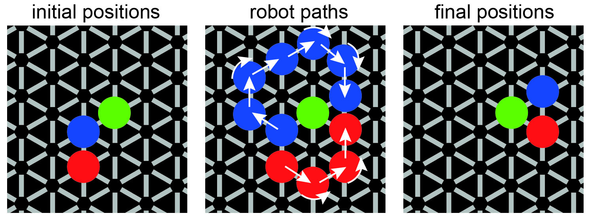

# Robot honeycomb maze

This project is comprised of code which allows the honeycomb maze, a behavioural task previously developed in the O'Keefe lab at UCL using an apparatus composed of an array of platforms affixed to linear actuators (see references below) and used to test hippcampal-dependent spatial memory, to be re-deployed using only 3 line-following robots.

In the original version of the maze, rats were trained to navigate to a particular platform on the maze for food reward. Each trial started from a pseudo-randomly selected raised platform. After placing the animal on the platform, two adjacent platforms would be raised and the animal was free to move to whichever of these he two he wished. After selecting a new platform, both the previously occupied platform and the unchosen platform would be lowered, two new platforms raised, and another choice made. Through this iterative process, the animal would navigate towards the goal platform, and when well-trained, he would typically take the most direct path, confirming that the goal location had been encoded in spatial memory. 

In this new version of the maze, the platforms are affixed to line-following robots. The animal starts each trial atop a stationary robot at a pseudo-randomly selected location in the room, and then two other platform-carrying robots drive to adjacent positions. As in the original task, the animal is then free to move to one of these adjacent platforms, at which point the previously occupied robot and the unchosen robot drive to positions adjacent to the newly chosen robot, and the process begins again, finishing once the animal reaches the goal location. 

The robot is custom-designed, using a Pi Pico W microcontroller to receive commands over WiFi and send commands to the motors. The floor is black with a pattern of white lines, which the robots detect using two Vishay TCRT5000 reflective sensors. This pattern allows the robots to position themselves at specific locations. 

Figure: The three robots are depicted in red, blue, and green. The green robot is the stationary robot, meaning this is the last chosen/currently occupied robot. The red and blue robots drive along the depicted trajectories to provide the animal with the next choice. Depending on the choice made, either the red or blue will become the stationary robot, and the other two robots will then drive to new positions to present the animal with the next choice. 

Three software packages are provided: 1) the "robot" package, 2) the "workstation" package, and 3) the video_tracking package. Details about each package are included in readme files located within each package, but we provide short summaries here. 

## 1) robot

The robot package provides code written in MicroPython to connect the robot to the WiFi router, to accept commands from the workstation, and to convert those input commands into output commands directed to the motor controller. 

## 2) workstation

The workstation package provides code written in Python to run the behavioural task, which involves selecting platform positions, calculating the robot trajectories and translating these into commands to send to the robots, an and registering the animal's choices. 

## 3) video_tracking

The video_tracking package provides code created in Bonsai, a common software framework used in behavioural neuroscience experiments (bonsai-rx.org). It uses a convolutional neural network that was pre-trained in DeepLabCut, an open source Python package, to track the rat and send its location to the workstation software, which then determines the animal's choice. 

## References

- Wood et al. Nature, 554:102-105, 2018
- Ormond and O'Keefe. Nature, 607:741-746, 2022