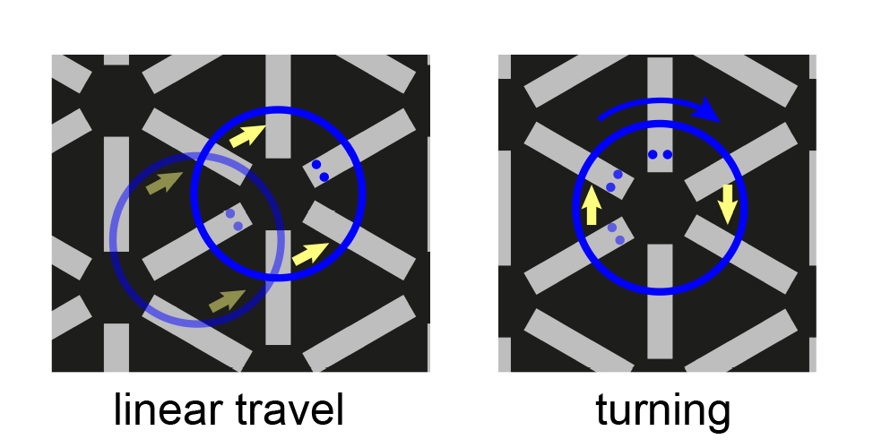

# Robot package

This package contains 3 pieces of code: 1) main.py, which runs immediately upon the robot being powered on, and which connects the robot to the WiFi router, 2) open_socket.py, which opens the socket connection with the workstation so that the robot can receive commands, and also translates those commands into function calls in 3) drive_robot.py, which directly controls the motor driver, and contains the functions for reading the line sensor, and for line following and turning.

The most straightforward way to work with the code on board the robot is using the Thonny IDE (thonny.org). The robot can be connected to a PC through the usb connection on the Pi Pico W. If the robot has already been powered up, in which case main.py is running, hit the stop button in Thonny. Somtimes it might be necessary to deselect and then reselect the Pi Pico W (lower right hand corner) in order to get access to its command prompt. At this point, files can be opened from the pi pico, and it can be saved to. If you wish to continue using the robot in the task, open the main.py, press play, and disconnect from the usb cable.  

### 1) main.py

Each robot's ip address and port number are defined in this file. Obviously, these values need to be different for each robot. In our set-up, we use the ip addresses '192.168.0.102', '192.168.0.103', '192.168.0.104', and the port numbers 65533, 65534, 65535. The network name and password are also hardcoded in main.py:


```
ssid = 'network_name'
password = 'password'
PORT = 65533 
ipconfig = ('192.168.0.104', '255.255.255.0', '192.168.0.1', '8.8.8.8')
```

### 2) open_socket.py

Handles the parsing of input commands and generation of the output commands. Commands from the workstation are sent as a string of digits, with the first digit indicating the function to execute from drive_robot.py. These functions are listed in the parse_data definition. The program executed during the task is called with '99', followed by the series of turns and straightline trajectories required for the robot to follow the path created by the workstation (see figure in main folder README.md; e.g., the red robot in that figure would have received the command '99, 0, 1, 1, 1, 1, 2, 1, 1, 1, 1'). 



Figure: The robot has two main modes of movement. On the left, using the sensors (the 2 blue dots), it can travel in a straightline along the white lines, detecting the gaps at the end of the lines to count the number of lines along which it's travelled. On the right, when it has crossed a gap and found the subsequent line, it can turn in place by running the two wheels in opposite directions; it reads the wheel encoders to determine how far it has turned, and when it has nearly turned the distance expected for the number of lines it should cross (in the example, the number is 2) it begins looking for the next line, and stops once it is found. 

For testing purposes, a few other functions are included (e.g., to read the sensors, pass ['94'] as the command). 

### 3) drive_robot.py

Contains the functions called by open_socket.py which directly control the motors and read the sensors. A number of numerical values are hard-coded here, including the distances between lines and the sensor values at which the presence of a line is assumed; the values would need to be altered for differently scaled floor patterns as well as different light levels. 

