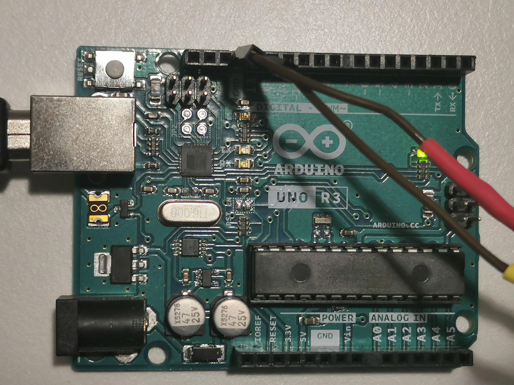

# video_tracking

Video tracking is performed in Bonsai (https://bonsai-rx.org/), a visual programming language popular in the field of behavioural neuroscience. In order to track the subject, the user must first train a convolutional neural network in DeepLabCut (https://github.com/DeepLabCut/DeepLabCut) using pre-recorded video of the same, or a visually similar, subject. After training the network, model and configuration files must be exported and loaded into Bonsai through the "PredictPose" node. 

The main behavioural task program (robot_maze/workstation/run_task.py) must be started before the video tracking, as it generates a text file containing the trial start time that the video tracking then uses in the filenames for the csv files it outputs (containing video timestamps, digitial pulse timestamps, crop timestamps, crop values, and tracking positions), as well as crop parameters (described below). At trial completion, the video tracking must be stopped so that run_task.py can copy and move the output files to short and long-term storage. 

To effectively track the animal, a high-resolution camera is required, but if the acquired images are left uncropped, the resulting video file will be very large. To mitigate this issue, we dynamically crop the images before storing them within the video file. This is possible because the animal can only ever be found within a sub-area of the field of view, and this sub-area is determined by the positions of the 3 robots. Every time the robots complete their trajectories to a new set of choice positions, run_task.py saves a .txt file containing crop coordinates. This file is immediately read by the video_tracking program, and then deleted. At the end of the trial, the video tracking will output files containing the timestamps at which the cropping parameters changed, as well as the values of those parameters, allowing the experimenter to recover the absolute positions of the frames and subject. 

To synchronize the video with electrophysiological recordings, robotMaze_DLC sends randomly timed digital pulses using a usb connected Arduino running the file "blink.ino" found in "robot_maze/video_tracking/arduino_code/". The timestamps of these pulses are saved in the file "pulseTS_DATA_TIME.csv". 

The extensions folder with ffmpeg writer needs to be in the folder containing the bonsai code.

